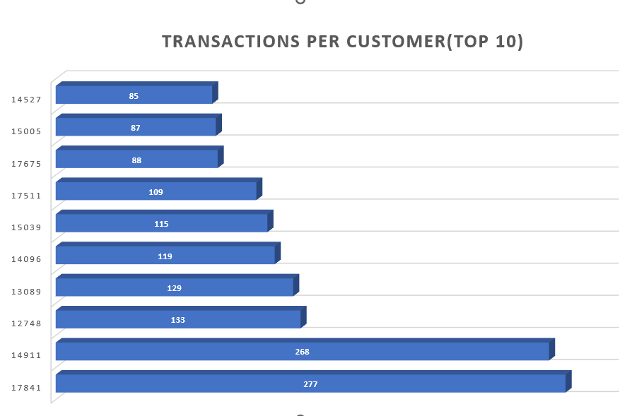
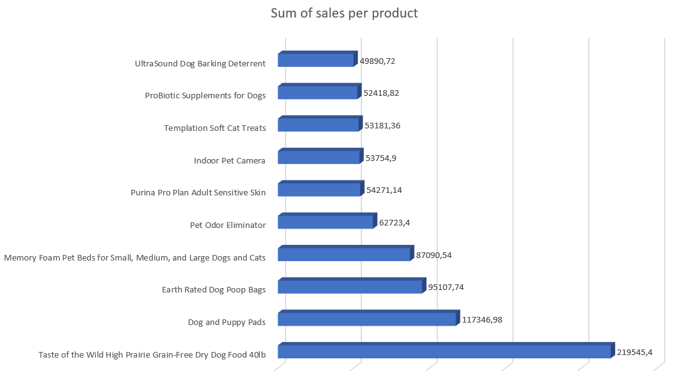

<h1><strong>Customer Segmentation</strong></h1>

<h2><strong>Project Purpose</strong></h2>
As an analyst, I've been tasked with analyzing transaction data to provide advice to a pet shop owner in the USA on how to increase sales.

<h2><strong>About the dataset</strong></h2>
&#8226; fact_sales.csv contains transaction data  
&#8226; dim_customers.csv contains customer data  
&#8226; dim_products.csv contains products data  
&#8226; state_region_mapping.csv contains data above locations  
&#8226; Data Cleaning folder contains cleaned data of fact_sales in .csv and sql script for data cleaning  
&#8226; RFM Analysis folder contains sql script for rfm analysis

<h2>Exploratory Data Analysis</h2>
&#8226; There were in total <strong>20151 transactions</strong> between <strong>2020-12-01</strong> and <strong>2021-12-09</strong>. 
&#8226; Transactions were made by <strong>3143 unique customers</strong>.  
&#8226; <strong>Which customers (top 10) did the most transactions ?</strong>  

  
 
&#8226; <strong>Which product made more profit (top 10)? </strong>  

