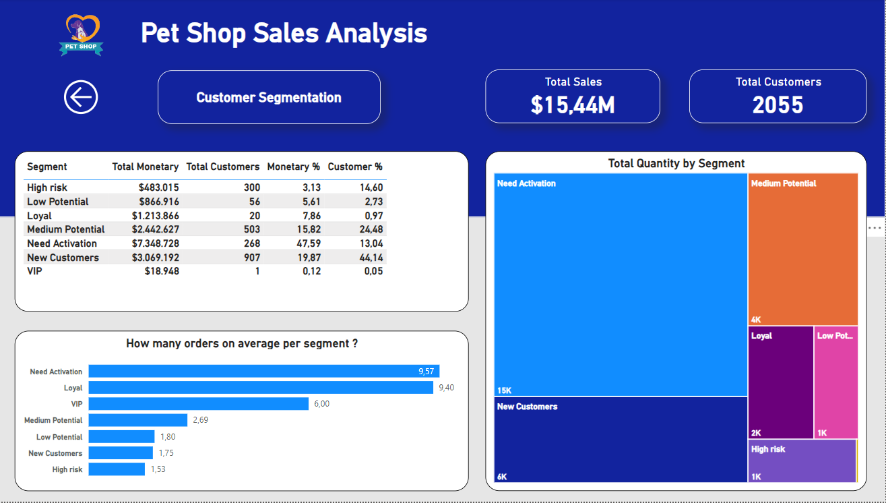

<h1><strong>Customer Segmentation</strong></h1>

<h2><strong>Table of Contents</h2></strong>

- [Report View](#report-view)
- [Project Purpose](#project-purpose)
- [About the Dataset](#about-the-dataset)
- [Exploratory Data Analysis](#exploratory-data-analysis)
- [RFM Analysis (steps)](#rfm-analysis-(steps))
- [Outcome and Recommendations](#outcome-and-recommendations)

<h2>Report View</h2>

<h2><strong>Project Purpose</strong></h2>
As an analyst, I have been tasked with analyzing transactional data (between 2020 and 2021) to provide strategic recommendations to a pet shop owner in the USA on how to effectively target customers and areas to increase sales.

<h2><strong>About the dataset</strong></h2>
&#8226; fact_sales.csv contains transactional data  
&#8226; dim_customers.csv contains customer data  
&#8226; dim_products.csv contains products data  
&#8226; state_region_mapping.csv contains data above locations  
&#8226; report.pbix is the final report in Power BI

<h2><strong>Exploratory Data Analysis</strong></h2>
&#8226; We observe that <strong>the best-selling categories</strong> are Food and Disposables ($3.7 million and $3.6 million, respectively).  
&#8226; As for products, Earth Rated Dog Poop Bags and Pet Odor Eliminator appear to be <strong>the top-selling products</strong> ($2.7 million and $1.9 million, respectively).  
&#8226; We observe <strong>spikes in total sales</strong> around 8 AM and 12 PM.  
&#8226; The East region generates the highest sales, and while Great Falls, New York, has the highest number of orders, Sarasota brings in higher profits.  
&#8226; In the Western regions, total sales are the lowest, while the number of invoices remains relatively high.  

<h2> <strong>RFM Analysis Explained and Steps </strong></h2>

&#8226; RFM Analysis stands for Recency (How recently a customer has purchased an item), Frequency (How often he/she makes a purchase) and Monetary (How much money does he/she spends). I will assign a score based on these three attributes. For the specific case, Recency will get values between 1 and 3 (1 being the best score), Frequency will get values between 1 and 3 ( but 3 being the highest score) and the same for Monetary. Scores are based on 3 quantiles ( I could use 4 if I wanted to go more in detail ), score of 1 means it belongs in the first quantile, 2 means in the second etc.

&#8226; First I will find <strong>Recency</strong> for each customer. Reference date will be the latest date appearing in the dataset. Lower recency values are better  
&#8226; Afterwards calculate <strong>Frequency</strong> for each customer. I have to count the unique number of days of purchases.  
&#8226; Calculate <strong>Monetary</strong> for each customer. Summ of Total Sales.  
&#8226; Next, create <strong>RFM scores</strong> based on quantiles of each distribution (recency,frequency,monetary).  
&#8226; Create <strong>segments</strong> based on Recency score, Frequency score and Monetary score.
&#8226; Check segments.txt to get more info.

<h2>Outcome and Recommendations</h2>
&#8226; Based on RFM analysis, we observe that approximately <strong> 48% of total sales come from around 13% of customers, who belong to the Need Activation segment</strong>.  
&#8226; The <strong>Need Activation segment</strong> consists of customers who <strong>have not made recent purchases but typically buy in large quantities and spend more money</strong>.  
&#8226; Based on the above results, in order to increase the sales, the <strong>Pet Showner could target more customers that belong to the Need Activation segment</strong>.  
&#8226; <strong>Focus more on Western regions</strong>, considered that this areas perform low regarding the sales.

